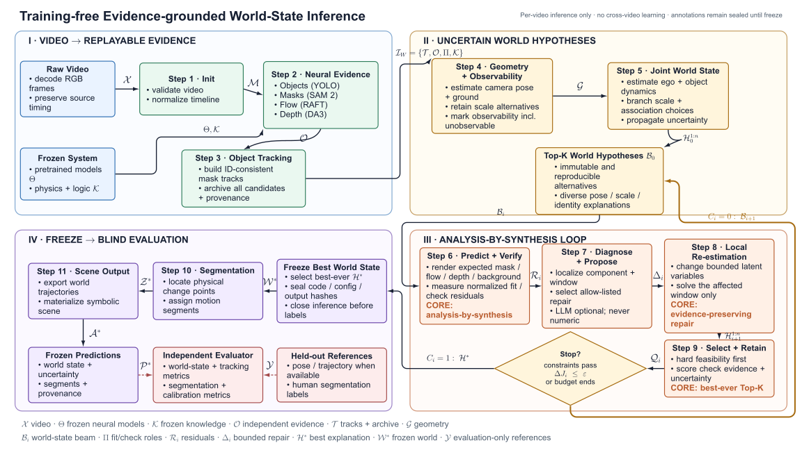

# `exp_august` Training-free World-State Inference

本文件解释 `exp_august` 的主流程图。系统对每个视频独立执行
**training-free, evidence-grounded, knowledge-constrained inference**：预训练视觉模型、物理知识、规则、阈值和 prompt 在测试前冻结；视频内可以优化 latent world state，但不能更新跨视频共享的模型参数。

人工标注不参与感知、world-state 构建、修正、候选排序或停止判断。只有在预测及其 manifest 冻结后，独立 evaluator 才能读取 held-out references。

## Authoritative flowchart

- Editable TikZ: [`EXP_AUGUST_CLOSED_LOOP_FLOWCHART.tex`](./EXP_AUGUST_CLOSED_LOOP_FLOWCHART.tex)
- Review PDF: [`EXP_AUGUST_CLOSED_LOOP_FLOWCHART.pdf`](./EXP_AUGUST_CLOSED_LOOP_FLOWCHART.pdf)
- Browser SVG: [`EXP_AUGUST_CLOSED_LOOP_FLOWCHART.svg`](./EXP_AUGUST_CLOSED_LOOP_FLOWCHART.svg)



TikZ 版本采用显式坐标并固定为 16:9。节点正文为 12 pt，箭头上的符号使用透明背景。所有图中文字均为英文。编译命令：

```powershell
lualatex -interaction=nonstopmode -halt-on-error EXP_AUGUST_CLOSED_LOOP_FLOWCHART.tex
```

## Four-module interpretation

### Module I - Video to Replayable Evidence

Steps 1-3 只负责生成和保存视觉证据：

- Step 1 验证视频并建立可逆的统一时间轴；
- Step 2 分别提取 detection、mask、optical flow 和 depth，不进行跨 cue 融合；
- Step 3 建立 ID-consistent mask tracks，保存所有候选、拒绝项、缺失项和 provenance，并用冻结策略生成 `EvidenceUsePlan` $\Pi$。

该模块不是论文的主要推理贡献，但必须保证后续阶段能够重新检查原始证据，而无需重新运行神经模型。

### Module II - Uncertain World Hypotheses

Steps 4-5 将图像空间证据转化为多个可审计的世界解释：

- Step 4 估计相机位姿、地面和尺度候选，并明确输出
  `metric | relative | ambiguous | unobservable`；
- Step 5 联合估计 ego 与 objects 的位置、速度、加速度、朝向及不确定性；
- 不同 scale、pose、identity association 和 occlusion 解释形成多样化的 Top-K beam。

Step 5 的输出不是一条已被强制平滑的轨迹，而是多个完整且不可变的 `WorldHypothesis`。

### Module III - Analysis-by-Synthesis Loop

Steps 6-9 是论文的主要算法贡献：

1. Step 6 将每个 3D world hypothesis 前向投影，预测其应在视频中产生的 mask、flow、depth 和 background-motion signatures；
2. 预测值与原始视觉证据比较，得到按 uncertainty 和 observability 归一化的 residual；
3. Step 7 定位失败的组件与时间窗口，并从冻结的 allow-list 中选择修正操作；
4. Step 8 只重新估计受影响的 latent variables 和局部窗口；
5. Step 9 先检查 hard feasibility，再使用 check evidence、复杂度和不确定性进行统一排序；
6. 未满足停止条件时，将新的 Top-K beam 送回 Step 6。

这个循环优化的是单个视频的 latent world state，不是模型权重。

### Module IV - Freeze to Blind Evaluation

搜索历史中的 best-ever hypothesis 被冻结为 world state，然后生成 temporal segments、symbolic scene 和可视化输出。Evaluator 在独立进程中读取冻结预测和 held-out references，不能把结果写回 inference。

## Notation legend

| Notation | Meaning | Main contents |
|---:|---|---|
| $\mathcal X$ | Raw video | RGB frames, timestamps, FPS and source geometry |
| $\Theta$ | Frozen neural models | YOLO, SAM 2, RAFT and DA3 checkpoints/configuration |
| $\mathcal K$ | Frozen knowledge | Physical limits, semantic rules and permitted repair bounds |
| $\mathcal M$ | Video manifest | Canonical timeline, run ID, fingerprints and model versions |
| $\mathcal O$ | Independent neural evidence | Detections, masks, forward/backward flow, depth, confidence and transforms |
| $\mathcal T$ | Tracking package | ID-consistent tracks plus immutable candidate/evidence archive |
| $\mathcal G$ | Geometry hypothesis set | Pose, ground, scale, 3D observations, covariance and observability |
| $\mathcal H_i$ | World hypothesis | Camera, scale, ego/object dynamics, associations and uncertainty |
| $\mathcal B_i$ | Hypothesis beam | Diverse Top-K world hypotheses at iteration $i$ |
| $\Pi$ | Evidence-use plan | Frozen designation of fit, check-only and report-only evidence |
| $\mathcal R_i$ | Residual packet | Fit/check residuals, physical violations and conflict windows |
| $\Delta_i$ | Repair proposal | Bounded operator, variables, window, parameter range and expected effect |
| $\mathcal Q_i$ | Scored ranking | Feasibility, score terms, rank, Top-K and improvement |
| $C_i$ | Stop decision | $0$: continue; $1$: freeze the best-ever explanation |
| $\mathcal H^*$ | Best explanation | Best feasible hypothesis over the entire search history |
| $\mathcal W^*$ | Frozen world state | Ego/object trajectories, motion states, uncertainty and provenance |
| $\mathcal Z^*$ | Temporal segmentation | Boundaries, labels and confidence derived from the frozen state |
| $\mathcal P^*$ | Frozen prediction package | World state, tracks, segments, curves and immutable manifest |
| $\mathcal Y$ | Held-out references | Pose/trajectory when available and human segmentation labels |

## Step input/output contract

| Step | Primary input | Primary output | Annotation access |
|---|---|---|---:|
| 1 - Init | $\mathcal X$, frozen configuration | validated `VideoManifest` $\mathcal M$ | No |
| 2 - Neural Evidence | canonical RGB, $\Theta$ | independent evidence store $\mathcal O$ | No |
| 3 - Object Tracking | $\mathcal O$ | replayable $\mathcal T$ and frozen evidence roles $\Pi$ | No |
| 4 - Geometry + Observability | $\mathcal T$, $\mathcal O$, $\mathcal K$ | ranked geometry set $\mathcal G$ | No |
| 5 - Joint World State | $\mathcal G$, $\mathcal T$, $\mathcal O$ | initial beam $\mathcal B_0$ | No |
| 6 - Predict + Verify | $\mathcal B_i$, $\mathcal O$, $\Pi$, $\mathcal K$ | auditable residual packets $\mathcal R_i$ | No |
| 7 - Diagnose + Propose | $\mathcal R_i$ and referenced evidence | bounded repair proposals $\Delta_i$ | No |
| 8 - Local Re-estimation | parents, $\Delta_i$, affected windows | child hypotheses $\mathcal H_{i+1}^{1:n}$ | No |
| 9 - Select + Retain | parents, children, fit/check residuals | $\mathcal Q_i$, $\mathcal B_{i+1}$, $\mathcal H^*$, $C_i$ | No |
| 10 - Segmentation | frozen $\mathcal W^*$ | temporal segmentation $\mathcal Z^*$ | No |
| 11 - Scene Output | $\mathcal W^*$, $\mathcal Z^*$ | symbolic scene and frozen $\mathcal P^*$ | No |
| Independent evaluation | $\mathcal P^*$, $\mathcal Y$ | physical, tracking, segmentation and calibration metrics | Read-only |

## Evidence-use plan and anti-circularity

物理上更平滑的轨迹不一定更接近真实情况。为避免“使用同一证据生成假设，再用该证据证明假设正确”，每次 run 在 world-state inference 前冻结 `EvidenceUsePlan` $\Pi$：

- **fit evidence**：允许 numerical solver 用于状态估计；
- **check-only evidence**：只用于候选接受、排序或非退化检查，当前 repair 不得优化它；
- **report-only references**：人工标注或外部传感器，只能在 freeze 后评估。

可作为 check-only 的信息包括 backward flow、未被选中的 mask candidates、unmatched detections、固定抽取的时空验证点以及某些 cue-family holdouts。每个 residual 必须注明其 evidence role。若一个实验无法提供独立 check evidence，结果必须明确标记为 `self-consistency only`，不能宣称恢复了真实 world state。

## Forward verification

对于 hypothesis $\mathcal H_i$ 和 cue family $c$：

$$
\hat y_{c,t}=g_c(\mathcal H_i),
\qquad
r_{c,t}=d_c(y_{c,t},\hat y_{c,t}),
$$

$$
z_{c,t}=\frac{r_{c,t}}
{\sqrt{\sigma^2_{\mathrm{obs},c,t}+\sigma^2_{\mathrm{pred},c,t}+\epsilon}}.
$$

Step 6 必须分别保存 observation、ego/background、object/identity、physics 和 semantic residual，不得过早压缩成一个分数。缺失证据降低 evaluability，而不是自动构成 violation。

## Bounded repair operators

闭环只能从版本化 allow-list 中选择操作：

- `relink_track`, `split_track`, `switch_mask_candidate`；
- `switch_pose_candidate`, `switch_scale_candidate`；
- `invalidate_or_downweight_cue`；
- `refit_local_dynamics`, `adjust_process_noise`；
- `mark_occluded`, `mark_unobservable`, `leave_unresolved`。

每个 proposal 必须声明 parent hypothesis、受影响变量、时间窗口、参数范围、目标 residual、预期 check-evidence 变化和计算预算。原始 evidence 不允许修改或删除。LLM/VLM 是可选诊断器，只能返回结构化失败类别和 allow-listed operator，不能直接写入物理数值。

## Selection and acceptance

候选先通过 hard feasibility gate，再进行 soft ranking：

$$
J(\mathcal H)=
J_{\mathrm{fit}}
+\lambda_{\mathrm{check}}J_{\mathrm{check}}
+\lambda_{\mathrm{phys}}J_{\mathrm{phys}}
+\lambda_{\mathrm{complex}}J_{\mathrm{complex}}
+\lambda_{\mathrm{unc}}J_{\mathrm{unc}}.
$$

新候选只有在以下条件成立时才可替换 parent：

1. 不新增 hard violation；
2. 目标 fit residual 改善；
3. check residual 改善或在冻结容差内不退化；
4. uncertainty 没有被无证据地缩小；
5. 改善超过复杂度与计算代价。

最终冻结整个搜索历史中的 best-ever hypothesis，而不是最后一轮结果。无法得到唯一解时输出多峰假设、宽区间或 `unobservable`，不能强制生成精确速度。

## Training-free experimental protocol

- **Development videos:** 用于设计算法、规则、阈值和 prompt；不执行梯度训练。
- **Optional calibration videos:** 只用于 uncertainty calibration 或阈值校准。
- **Blind test videos:** 系统冻结后逐视频独立运行；不能跨视频更新权重、先验或 prompt。

预训练模型可在外部数据上训练，但在本文 pipeline 内全部冻结。因此更准确的表述是 `training-free target-video inference`，而不是声称整个系统从未使用任何训练数据。

## Paper-facing falsifiable claims

论文至少应验证：

1. 闭环降低 held-out trajectory/pose/segmentation error，而不只是降低自身 residual；
2. analysis-by-synthesis 优于 raw pipeline 和普通 smoothing；
3. uncertainty interval 具有合理 coverage，且系统能识别 scale ambiguity 与 unobservable cases；
4. training-free inference 能在冻结配置下跨视频或跨数据集工作；
5. 去除 check evidence、physics、beam search、repair 或 LLM 后的性能变化可被独立测量。

如果缺少 pose/trajectory ground truth，只能报告 segmentation 和 self-consistency 结果，并将“恢复真实物理量”作为尚未被完全验证的限制。

## Canonical world-state object

```text
WorldHypothesis
├── hypothesis_id / parent_id / iteration
├── camera_pose_trajectory + covariance
├── scale_hypothesis + observability + interval
├── ego_state: position, velocity, acceleration, heading, yaw_rate
├── object_world_trajectories + motion states
├── observation_assignments + evidence roles
├── fit_residuals / check_residuals / physical_residuals
├── hard_constraint_status
├── uncertainty + evaluability
├── score_breakdown
├── repair_history
└── provenance
```

闭环内部应以该类型化对象替代对大型 `state: dict` 的任意原地修改。现有 `state` 只作为迁移期间的兼容容器。
