# exp_august 无标注知识约束闭环 Pipeline

本文档描述计划中的 `exp_august` 主流程。系统在推断阶段只接收视频及预先冻结的通用配置/知识，不读取人工 segmentation。人工标注只能在最终预测冻结后，由独立评估程序读取。

## TikZ flowchart (authoritative version)

- Editable source: [`EXP_AUGUST_CLOSED_LOOP_FLOWCHART.tex`](./EXP_AUGUST_CLOSED_LOOP_FLOWCHART.tex)
- Review and print version: [`EXP_AUGUST_CLOSED_LOOP_FLOWCHART.pdf`](./EXP_AUGUST_CLOSED_LOOP_FLOWCHART.pdf)
- Markdown/browser version: [`EXP_AUGUST_CLOSED_LOOP_FLOWCHART.svg`](./EXP_AUGUST_CLOSED_LOOP_FLOWCHART.svg)


The TikZ version uses absolute coordinates for all modules and nodes. Arrow
routes, bend points, and mathematical-label offsets can be adjusted
independently. Nodes summarize responsibilities with short task bullets, while
edge symbols carry the data semantics. `KEY` marks the main methodological
highlight of selected nodes. Node body text is fixed at 12 pt, with a 4 pt gap
between each title and its bullets. All numbered-step bullets are left-aligned;
the two-row notation legend also uses 12 pt text. Edge symbols use transparent
backgrounds. Compile it with LuaLaTeX:

```powershell
lualatex -interaction=nonstopmode -halt-on-error EXP_AUGUST_CLOSED_LOOP_FLOWCHART.tex
```

<!-- Legacy Mermaid draft retained in source only; it is intentionally hidden
because TikZ is the authoritative diagram.

四个主模块采用 2×2 顺时针布局，更充分地利用 16:9 屏幕：左上完成视频观测，右上建立初始状态和约束，右下执行重估计与选优，左下冻结输出并进行独立盲评估。箭头采用 LaTeX notation，节点字号为 16px，箭头记号单独放大。

```mermaid
%%{init: {"flowchart": {"htmlLabels": true, "curve": "basis", "nodeSpacing": 30, "rankSpacing": 48, "padding": 18, "wrappingWidth": 240, "useMaxWidth": true}, "themeVariables": {"fontSize": "16px"}, "themeCSS": ".edgeLabel { font-size: 21px !important; font-weight: 600 !important; transform: translateY(-10px); } .edgeLabel .katex { font-size: 1.2em !important; } .edgeLabel rect, .labelBkg { opacity: 0.94 !important; rx: 6px; ry: 6px; } .nodeLabel { line-height: 1.3; }"}}%%
flowchart TB
    subgraph ROW_TOP[" "]
        direction LR

        subgraph MOD_A["I · VIDEO → OBSERVATIONS"]
            direction TB
            subgraph A_TOP[" "]
                direction LR
                V["<b>原始视频</b><br/>IN · RGB / FPS / 分辨率<br/>OUT · 帧与时间轴"]
                K["<b>冻结知识与配置</b><br/>IN · 物理/类别先验<br/>OUT · config version"]
                S1["<b>Step 1 · Video-only Init</b><br/>IN · 视频 + config<br/>OUT · manifest"]

                V -->|"$$\mathcal{X}$$"| S1
                K -->|"$$\mathcal{K}$$"| S1
            end

            subgraph A_BOTTOM[" "]
                direction LR
                S2["<b>Step 2 · 视觉观测</b><br/>IN · 帧序列<br/>OUT · 检测/光流/深度"]
                S3["<b>Step 3 · 多假设跟踪</b><br/>IN · 视觉观测<br/>OUT · tracks/静态参考"]
                S4["<b>Step 4 · 几何与尺度</b><br/>IN · tracks/背景/深度<br/>OUT · 位姿/尺度候选"]

                S2 -->|"$$\mathcal{O}$$"| S3
                S3 -->|"$$\mathcal{T}$$"| S4
            end

            %% 直接从 Step 1 右侧绕向 Step 2，避免箭头落在两行中央。
            S1 -->|"$$\mathcal{M}$$"| S2
        end

        subgraph MOD_B["II · INITIAL STATE → CONSTRAINTS"]
            direction TB
            subgraph B_TOP[" "]
                direction LR
                S5["<b>Step 5 · 联合状态</b><br/>IN · 位姿/尺度/tracks<br/>OUT · 初始世界假设"]
                H["<b>Top-K 世界假设</b><br/>IN · 初始状态或上一轮 beam<br/>OUT · 当前候选集"]

                S5 -->|"$$\mathcal{H}_0$$"| H
            end

            subgraph B_BOTTOM[" "]
                direction LR
                S6["<b>Step 6 · 一致性检测</b><br/>IN · 假设/观测/冻结知识<br/>OUT · 多维约束残差"]
                S7["<b>Step 7 · 证据检查</b><br/>IN · 残差/关键帧/曲线<br/>OUT · 冲突证据包"]
                REPAIR["<b>知识 + 数值修正</b><br/>IN · 证据/允许参数空间<br/>OUT · 有界修正方案<br/>LLM 不直接生成数值"]

                S6 -->|"$$\mathcal{R}_i$$"| S7
                S7 -->|"$$\mathcal{E}_i$$"| REPAIR
            end

            %% 从 Top-K 节点直接弯折进入一致性检测。
            H -->|"$$\mathcal{B}_i$$"| S6
        end

        %% 跨模块边在本行末尾连接模块容器，以保持严格 2×2 排列。
        MOD_A -->|"$$\left(\mathcal{G},\mathcal{O},\mathcal{K}\right)$$"| MOD_B
    end

    subgraph ROW_BOTTOM[" "]
        direction RL

        subgraph MOD_C["III · RE-ESTIMATE → SELECT"]
            direction TB
            subgraph C_TOP[" "]
                direction LR
                S8["<b>Step 8 · 局部重估计</b><br/>IN · 修正方案/冲突窗口<br/>OUT · 新候选假设"]
                S9["<b>Step 9 · 统一评分</b><br/>IN · 候选/全部残差<br/>OUT · Hard/soft 分项分数"]

                S8 -->|"$$\mathcal{H}_{i+1}^{1:n}$$"| S9
            end

            subgraph C_BOTTOM[" "]
                direction LR
                BEST["<b>Best-ever Register</b><br/>IN · 本轮候选排名<br/>OUT · Top-K / 历史最优 / ΔJ"]
                STOP{"<b>停止条件</b><br/>硬约束通过？<br/>ΔJ ≤ ε / 预算耗尽？"}
                LOOPBACK["<b>↺ Feedback to Module II</b><br/>继续时输出下一轮 hypothesis beam"]

                BEST -->|"$$\mathcal{H}^{*},\;\Delta J_i$$"| STOP
                STOP ==>|"$$C_i=0:\;\mathcal{B}_{i+1}$$"| LOOPBACK
            end

            %% 从评分节点直接弯折到历史最优寄存器。
            S9 -->|"$$\mathcal{Q}_i$$"| BEST
        end

        subgraph MOD_D["IV · FREEZE → BLIND EVALUATION"]
            direction TB
            subgraph D_TOP[" "]
                direction LR
                FREEZE["<b>冻结历史最优解释</b><br/>IN · best-ever hypothesis<br/>OUT · 不可变物理状态"]
                S10["<b>Step 10 · Temporal Segmentation</b><br/>IN · 冻结状态/change points<br/>OUT · 边界/标签/置信度"]
                S11["<b>Step 11 · 符号场景</b><br/>IN · segments/轨迹/审计<br/>OUT · atoms/曲线/provenance"]

                FREEZE -->|"$$\mathcal{W}^{*}$$"| S10
                S10 -->|"$$\mathcal{Z}^{*}$$"| S11
            end

            subgraph D_BOTTOM[" "]
                direction LR
                PRED[("<b>冻结 Predictions</b><br/>JSON / CSV / 视频 / manifest")]
                ANN[("<b>人工 Segmentation</b><br/>仅 Evaluator 可读")]
                EV["<b>独立盲评估</b><br/>IN · predictions + annotations<br/>OUT · F1/tIoU/混淆矩阵"]

                PRED -. "$$\mathcal{P}^{*}$$" .-> EV
                ANN -. "$$\mathcal{Y}$$" .-> EV
            end

            %% 从符号场景节点直接弯折到冻结预测。
            S11 -->|"$$\mathcal{A}^{*}$$"| PRED
        end

        %% direction RL 固定 Module IV 在左、Module III 在右。
        MOD_C -->|"$$C_i=1:\;\mathcal{H}^{*}$$"| MOD_D
    end

    %% 只用单向 row-level 边固定上下两行；任何真实节点的跨模块边
    %% 都会使 Dagre 忽略嵌套 direction，并把四个主模块排成一列。
    ROW_TOP -->|"$$\Delta_i$$"| ROW_BOTTOM

    classDef source fill:#eaf3ff,stroke:#2f6fb3,stroke-width:1.8px,color:#172033;
    classDef observe fill:#eaf8f0,stroke:#2e7d5b,stroke-width:1.8px,color:#172033;
    classDef hypothesis fill:#fff5dc,stroke:#a66b10,stroke-width:1.8px,color:#172033;
    classDef reasoning fill:#fff0e6,stroke:#b85c2e,stroke-width:1.8px,color:#172033;
    classDef score fill:#fff9df,stroke:#8c7318,stroke-width:1.8px,color:#172033;
    classDef frozen fill:#f2ecff,stroke:#6842a8,stroke-width:1.8px,color:#172033;
    classDef evaluation fill:#fdecec,stroke:#a34848,stroke-width:1.8px,color:#172033;

    class V,K source;
    class S1,S2,S3,S4 observe;
    class S5,H,S6,S7,S8 hypothesis;
    class REPAIR reasoning;
    class S9,BEST,STOP,LOOPBACK score;
    class FREEZE,S10,S11,PRED frozen;
    class ANN,EV evaluation;

    style ROW_TOP fill:transparent,stroke:transparent,color:transparent;
    style ROW_BOTTOM fill:transparent,stroke:transparent,color:transparent;
    style A_TOP fill:transparent,stroke:transparent,color:transparent;
    style A_BOTTOM fill:transparent,stroke:transparent,color:transparent;
    style B_TOP fill:transparent,stroke:transparent,color:transparent;
    style B_BOTTOM fill:transparent,stroke:transparent,color:transparent;
    style C_TOP fill:transparent,stroke:transparent,color:transparent;
    style C_BOTTOM fill:transparent,stroke:transparent,color:transparent;
    style D_TOP fill:transparent,stroke:transparent,color:transparent;
    style D_BOTTOM fill:transparent,stroke:transparent,color:transparent;
    style MOD_A fill:#f8fbff,stroke:#8baed1,stroke-width:1.4px;
    style MOD_B fill:#fffbf2,stroke:#d29a3a,stroke-width:1.4px;
    style MOD_C fill:#fffdf4,stroke:#b99d35,stroke-width:1.4px;
    style MOD_D fill:#faf8ff,stroke:#9c82c8,stroke-width:1.4px;
```



> 渲染要求：箭头上的 LaTeX 使用 Mermaid 的 KaTeX 支持。若预览中显示原始 `$$...$$`，需要升级到支持数学公式的 Mermaid 版本或 VS Code Mermaid 预览扩展。
-->

### Notation legend

| 记号 | 含义 | 主要内容 |
|---:|---|---|
| $\mathcal{X}$ | Video input | RGB 帧、FPS、分辨率和统一时间轴 |
| $\mathcal{K}$ | Frozen knowledge | 配置哈希、物理范围、类别知识和允许的修正边界 |
| $\mathcal{M}$ | Video manifest | 视频 ID、运行 ID、时间轴及输入指纹 |
| $\mathcal{O}_t=(D_t,S_t,F_t,Z_t,U_t)$ | Neural evidence store | YOLO detections、SAM 2 masks、RAFT optical flow、DA3 depth 及各自的不确定性；尚未执行跨帧关联或 evidence fusion |
| $\mathcal{T}$ | ID-aligned object masklets | 由 detector-guided SAM 2 video propagation 与 multi-cue Hungarian association 产生；包含时序 boxes、真实 masks、flow/depth 关联证据、tracking confidence、遮挡状态及 provenance |
| $\mathcal{G}$ | Geometry hypotheses | 相机位姿、地面模型、尺度候选及置信区间 |
| $\mathcal{H}_0$ | Initial world hypothesis | 初始 Ego 状态和对象 3D 世界轨迹 |
| $\mathcal{B}_i$ | Hypothesis beam | 第 $i$ 轮输入的一组 Top-K 世界假设 |
| $\mathcal{R}_i$ | Constraint residuals | 重投影、光流、物理、背景和语义残差 |
| $\mathcal{E}_i$ | Evidence packet | 关键帧、冲突窗口、曲线和可疑组件 |
| $\Delta_i$ | Repair proposals | 第 $i$ 轮有界的尺度、位姿、滤波、track 或阈值修正 |
| $\mathcal{H}_{i+1}^{1:n}$ | Re-estimated hypotheses | 应用 $\Delta_i$ 后局部重算得到的新候选集合 |
| $\mathcal{Q}_i$ | Scored ranking | Hard-constraint 状态、分项分数、Top-K、`best_ever` 和 $\Delta J_i$ |
| $C_i$ | Stop decision | $0$ 表示继续循环；$1$ 表示停止并冻结历史最优解释 |
| $\mathcal{H}^{*}$ | Best explanation | 整个搜索历史中统一评分最优的世界解释 |
| $\mathcal{W}^{*}$ | Frozen world state | 冻结的 Ego/Object 位置、速度、加速度、yaw-rate 和轨迹 |
| $\mathcal{Z}^{*}$ | Final segmentation | 最终片段边界、运动标签、边界证据和置信度 |
| $\mathcal{A}^{*}$ | Symbolic scene | Logic atoms、物理曲线、候选排名和 provenance |
| $\mathcal{P}^{*}$ | Frozen predictions | 只读的 JSON、CSV、视频、曲线和冻结 manifest |
| $\mathcal{Y}$ | Human annotations | 人工 segmentation；只允许独立 Evaluator 读取 |

### Arrow legend

- `→`：阶段之间传递数据或状态。
- `⇒`：闭环控制信号；$C_i=0$ 时把 $\mathcal{B}_{i+1}$ 送入下一轮。
- `⇢`：只读评估数据；$\mathcal{P}^{*}$ 和 $\mathcal{Y}$ 均不得反馈到推断流程。
- 下标 $i$ 表示当前迭代轮次；星号 $*$ 表示已经选优并冻结。

## 步骤输入输出契约

| 步骤 | 主要输入 | 主要输出 | 是否允许使用人工 segmentation |
|---|---|---|---:|
| Step 1：初始化 | 原始视频、冻结配置、随机种子 | Video validation、timeline normalization、运行 ID | 否 |
| Step 2：神经感知 | RGB 帧 | 独立的 YOLO detections、SAM 2 masks、RAFT flow、DA3 depth 和不确定性 | 否 |
| Step 3：目标 mask 跟踪 | $\mathcal{O}_t$ 神经证据包 | ByteTrack 仅生成 detector track prompts；SAM 2 Video Predictor 传播 masks；Hungarian matcher 融合 mask/RAFT flow/box/class/depth，输出稳定 ID masklets 与遮挡审计 | 否 |
| Step 4：几何与尺度假设 | 背景特征、tracks、深度、相机元数据 | 相机位姿、地面、metric-scale 候选及区间 | 否 |
| Step 5：初始联合状态 | 位姿、尺度和 tracks | `WorldHypothesis H0`：Ego 与对象的 3D 状态 | 否 |
| Step 6：一致性检测 | 当前假设、原始观测、知识库 | 约束违反、残差、冲突帧、疑似错误组件 | 否 |
| Step 7：证据选择与知识推理 | 异常窗口、关键帧、运动曲线 | 结构化证据包、LLM/VLM 修正建议 | 否 |
| Step 8：局部重新估计 | 修正方案、受影响窗口 | 多个新的 `WorldHypothesis` 候选 | 否 |
| Step 9：评分与循环控制 | 候选假设及约束残差 | Top-K、历史最优 `H*`、停止决定 | 否 |
| Step 10：最终时间分段 | 冻结的 `H*` | 片段、标签、边界证据和置信度 | 否 |
| Step 11：符号化与报告 | Segments、轨迹、推理审计 | Logic atoms、物理曲线、provenance、冻结预测 | 否 |
| 独立评估 | 冻结预测、人工 segmentation | Boundary F1、分类 F1、tIoU、混淆矩阵 | 是，仅只读评估 |

## 闭环允许修改的内容

每轮修正只能在预先声明的候选空间中进行：

- 静态背景参考对象集合；
- 相机位姿与深度尺度候选；
- Ego 速度、加速度和 yaw-rate 的滤波/平滑模型；
- Track 的关联、拆分、合并及遮挡恢复；
- 异常深度或异常光流观测的权重；
- 局部运动状态阈值和 change point；
- 受冲突影响时间窗口内的检测、跟踪和几何重算。

LLM/VLM 只能给出结构化错误归因、约束选择和有限修正建议，不能直接输出最终逐帧速度、轨迹或 segmentation 标签。

## 最优解释评分

```text
J(H) =
  w_obs        * observation_error
+ w_reproject  * reprojection_error
+ w_flow       * background_flow_error
+ w_physics    * physics_violation
+ w_semantic   * semantic_violation
+ w_complexity * explanation_complexity
+ w_uncertainty* unresolved_uncertainty
```

先用 hard constraints 淘汰非法候选，再依据上述 soft score 排序。最终输出必须采用整个搜索历史中的最优解释，而不是简单采用最后一轮结果。

## 数据隔离规则

1. Pipeline 进程不得挂载或读取 `annotations/video_segmentation`。
2. 人工标注不得参与阈值选择、候选排序、循环停止、超参数调整或 LLM 提示构造。
3. 推断完成后写入冻结 manifest，其中包含代码版本、配置哈希、模型版本和输出哈希。
4. Evaluator 只读冻结预测和人工标注，不能回写 pipeline 状态。
5. 用于反复开发的标注集合属于 `dev/eval`；正式 `test` 必须保持隐藏并只做最终报告。

## 计划中的核心状态对象

```text
WorldHypothesis
├── hypothesis_id / parent_id / iteration
├── camera_pose_trajectory
├── metric_scale_hypothesis + confidence_interval
├── ego_state: position, velocity, acceleration, yaw_rate
├── object_world_trajectories
├── observation_assignments
├── constraint_residuals
├── hard_constraint_status
├── score_breakdown
├── repair_history
└── provenance
```

该对象应替代闭环内部对大型无类型 `state: dict` 的任意修改；现有 `state` 可以暂时保留为步骤间的外层兼容容器。
